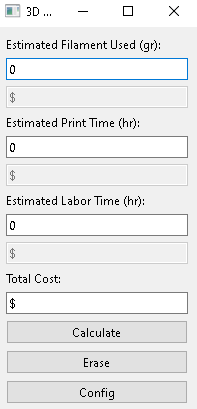

# 3D-Printing-Costs-Calculator
A 3D printing costs calculator with a simple GUI, where you can enter filament consumption, print time and labor time to estimate the total cost of a 3D print, after calculating the total, the calculator saves the data in a .csv file. It has a button to access settings where you can save config to an .ini file for filament weight, electricity and labor cost.

## Preview


## Installation
- Install PyQt6 for the GUI.
```
pip install PyQt6
```